# ЯПИИ 2024
## Лабораторная работа 2
#### Студент: Еленга Невлора Люглеш
#### Ст: 1032245779
#### Группа:НПИмд-01-24

### Задачи: 

. Установка ROS2 Humble

. Изучить планировщик Pyperplan https://github.com/aibasel/pyperplan

. Построить модель среды с tb3 (4) с манипулятором, либо любой другой колесный робот с манипулятором https://emanual.robotis.com/docs/en/platform/turtlebot3/machine_learning/

. Создать ROS узел с планировщиком.

### Выполнение

1. Установить ROS2 Humble
Изучить планировщик Pyperplan https://github.com/aibasel/pyperplan

- Установка Ubuntu

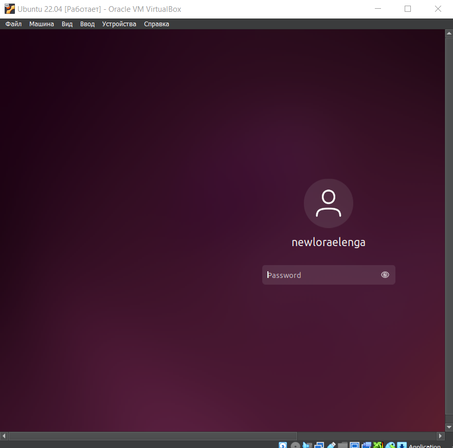{#fig:001 width=70%}

- Установка Ros2 Humble:

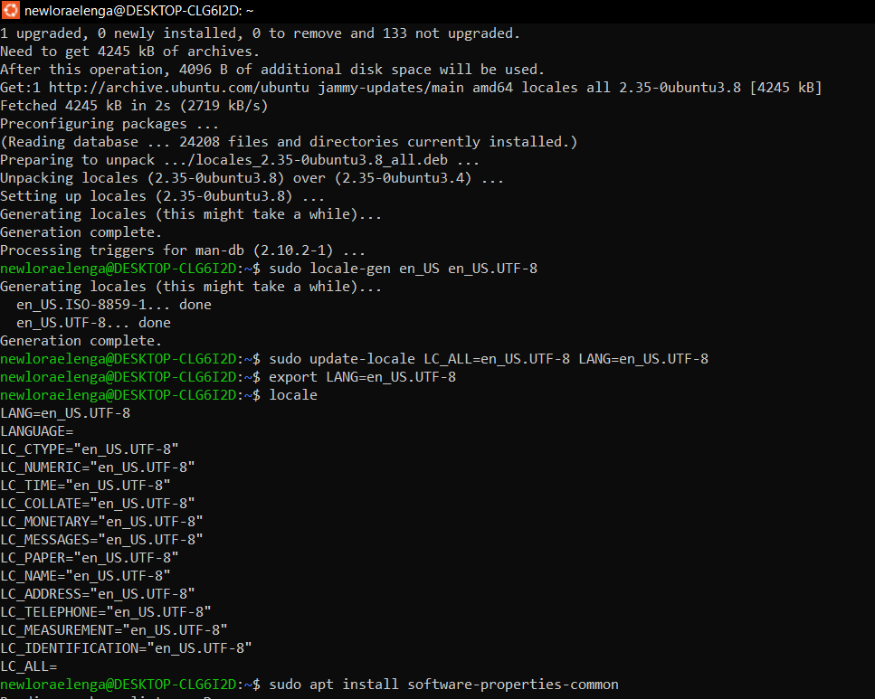{#fig:002 width=70%}

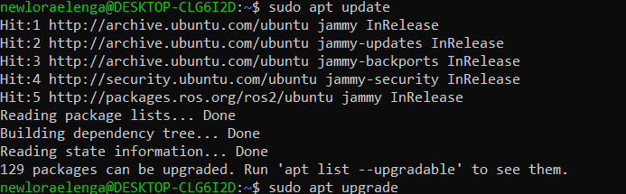{#fig:003 width=70%}

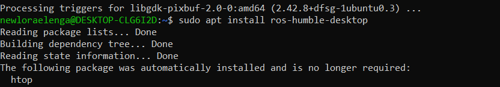{#fig:004 width=70%}

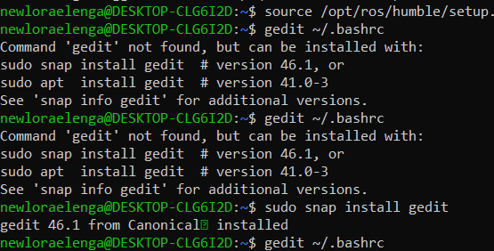{#fig:005 width=70%}

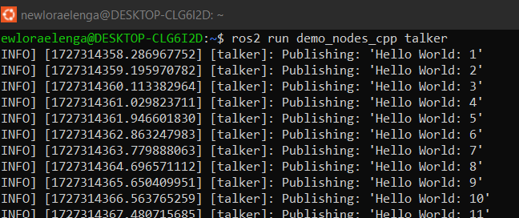{#fig:006 width=70%}

2)  Изучили планировщик Pyperplan https://github.com/aibasel/pyperplan.

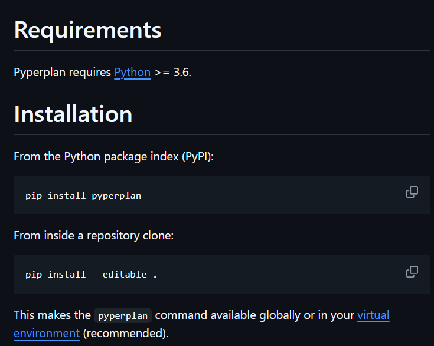{#fig:004 width=70%}

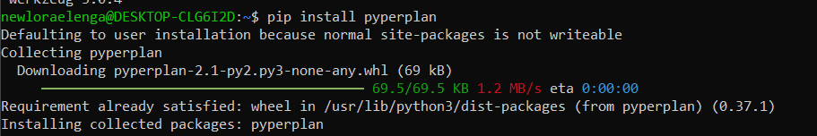{#fig:005 width=70%}
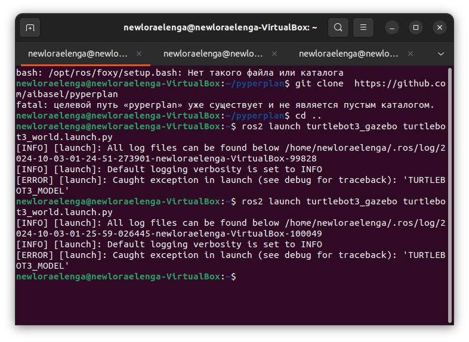{#fig:005 width=70%}

3) Построение модели среды с tb3 (4) с манипулятором, либо любой другой колесный робот с манипулятором https://emanual.robotis.com/docs/en/platform/turtlebot3/machine_learning/

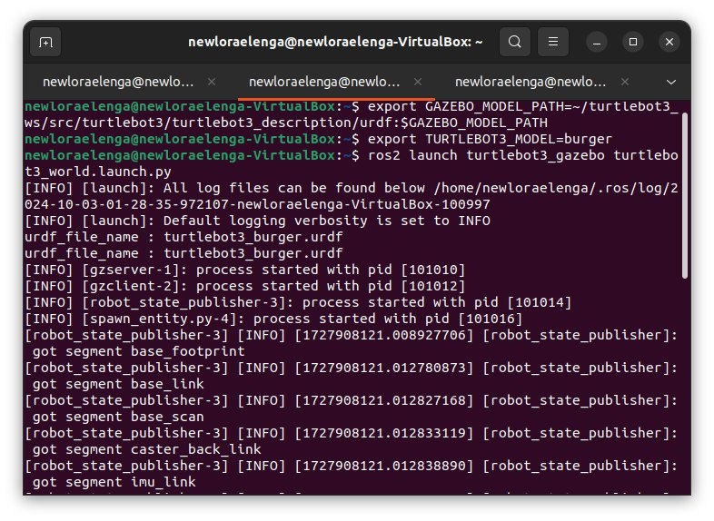{#fig:005 width=70%}
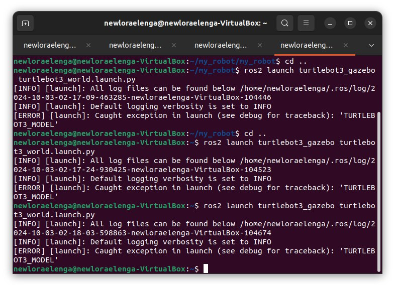{#fig:005 width=70%}
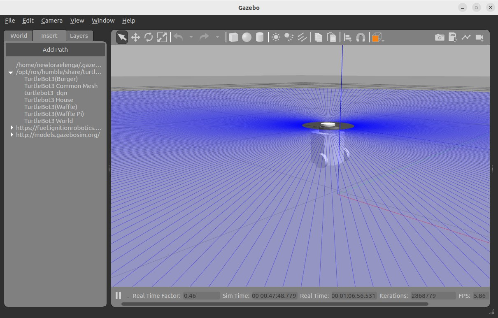{#fig:005 width=70%}
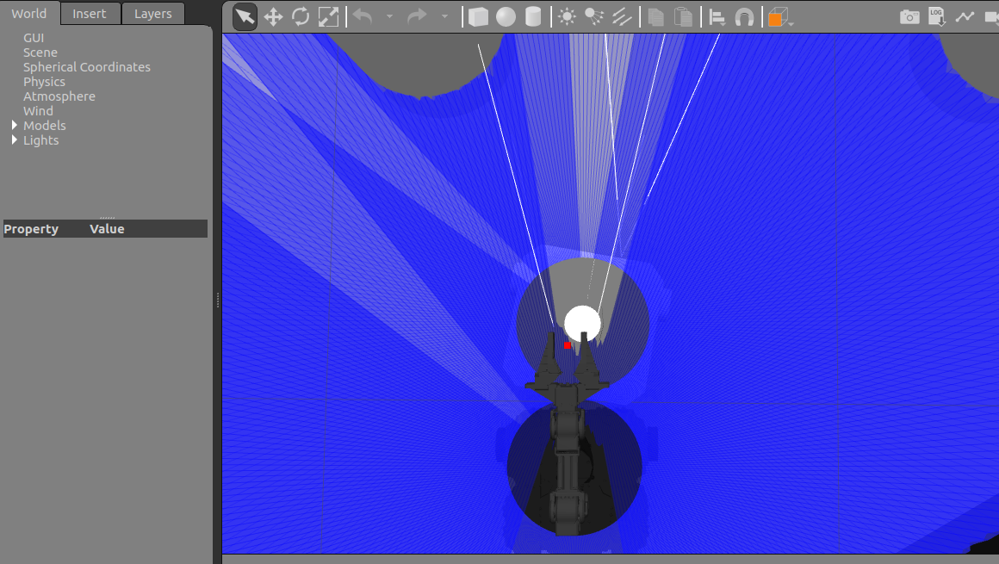{#fig:005 width=70%}

4)  Создание ROS узел с планировщиком.

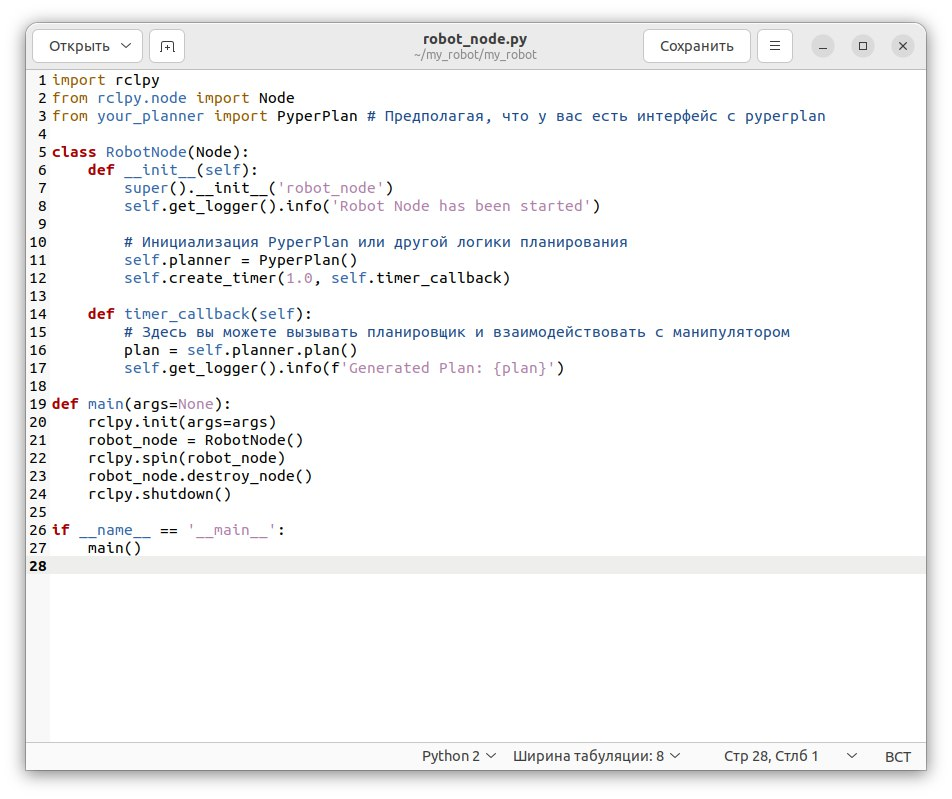{#fig:005 width=70%}
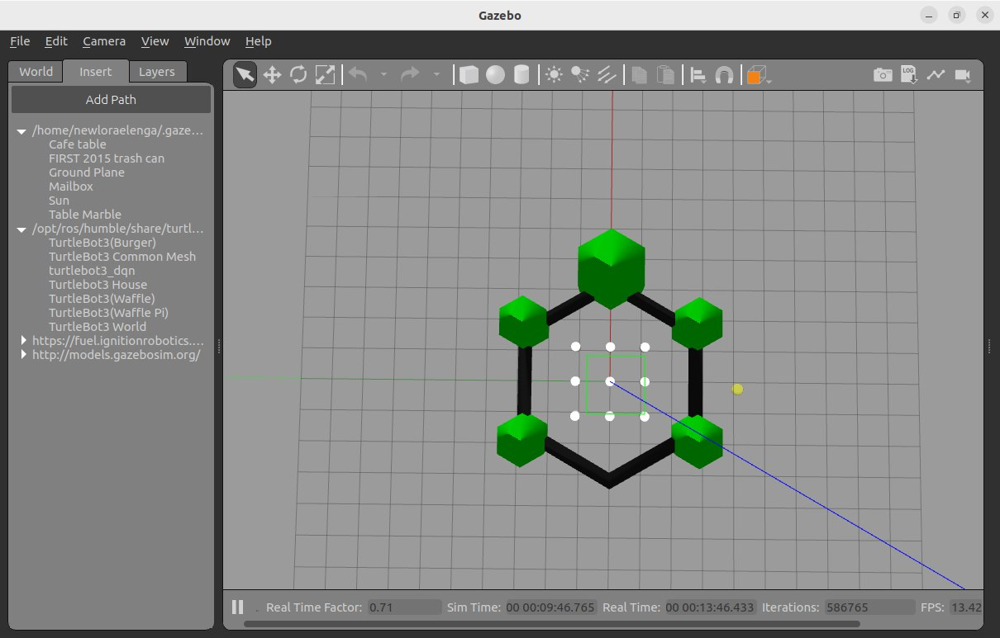{#fig:005 width=70%}