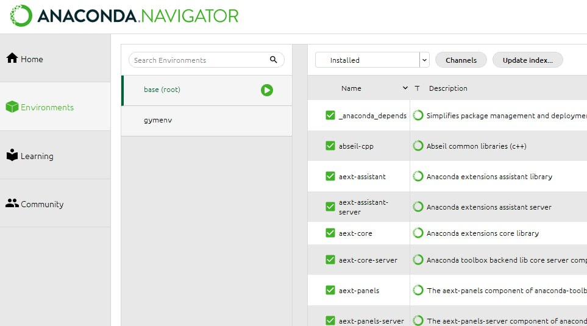
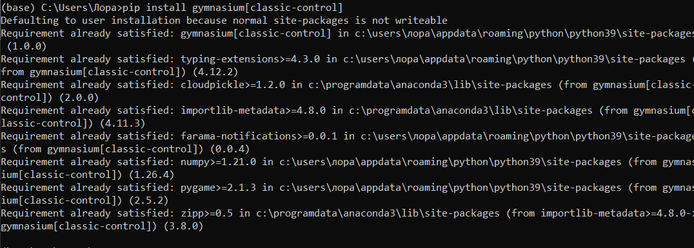
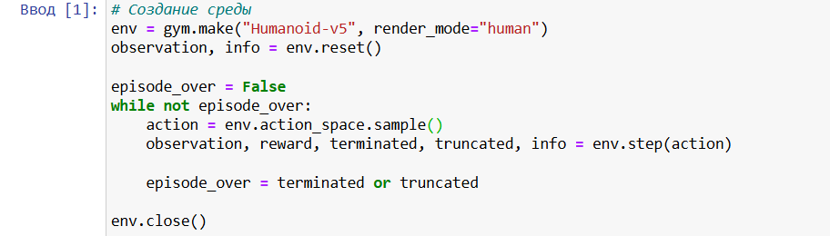
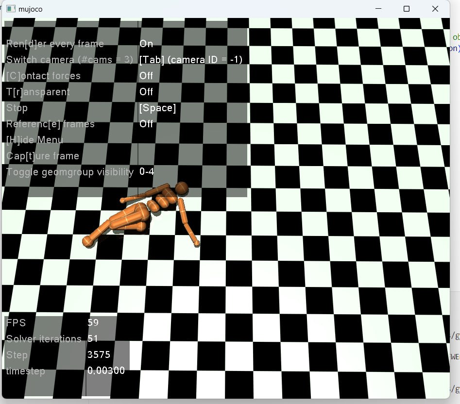

# ЯПИИ 2024
## Лабораторная работа 4
#### Студент: Еленга Невлора Люглеш
#### Ст: 1032245779
#### Группа:НПИмд-01-24

### Задачи: 

. Прочитать статьи. 
. Запустить Gymnasium  
. На ТБ3-4 Запустить планирование маршрута любым из алгоритмов RL (Лучше DDPG\PPO)
. Проанализировать пространство на основе алгоритма из 1 лабораторной и использовать его как функцию оценки в RL

### Выполнение

1. Запустили Gymnasium

  {#fig:003 width=70%}

{#fig:001 width=70%}

  - Установка необходимых библиотек

{#fig:004 width=70%}

2. На ТБ3-4 Запустить планирование маршрута любым из алгоритмов RL (Лучше DDPG\PPO)

{#fig:003 width=70%}
{#fig:002 width=70%}

 - Инициализация среды

 - Выбор алгоритм PPO и обучение алгоритма

{#fig:006 width=70%}

{#fig:006 width=70%}

 - Анализ пространства

3. Построение пути с помощью сплайнов

Создали систему, которая будет управлять передвижением ы робототехнического агента из точки A в точку B, используя STRIPS для планирования и сплайн-методы для построения пути.

